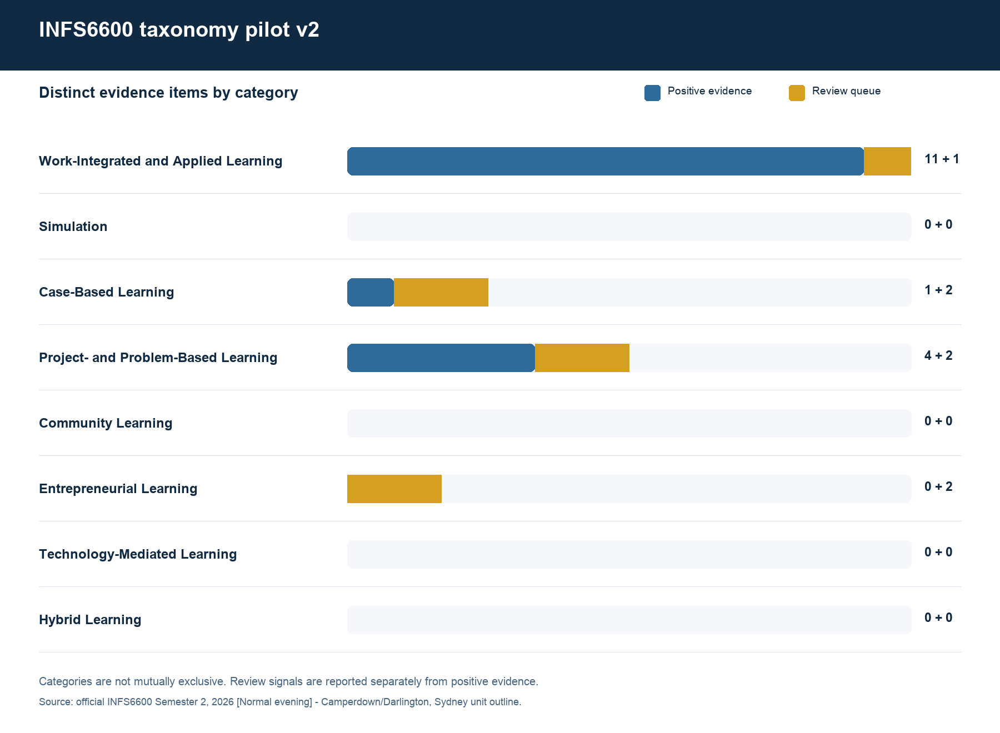
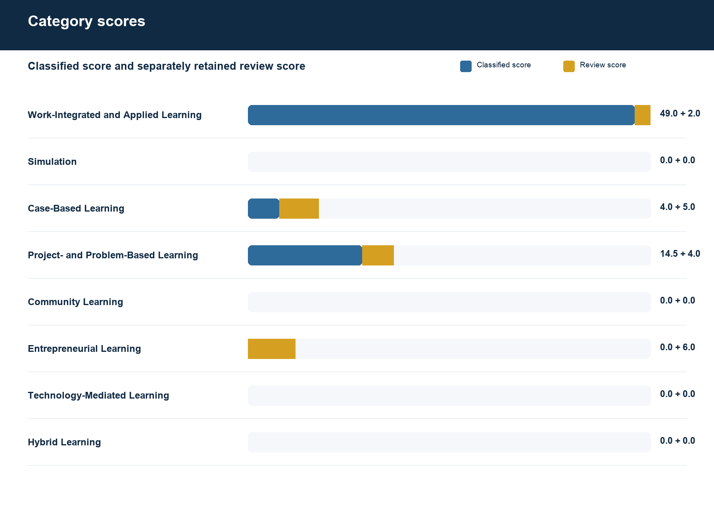
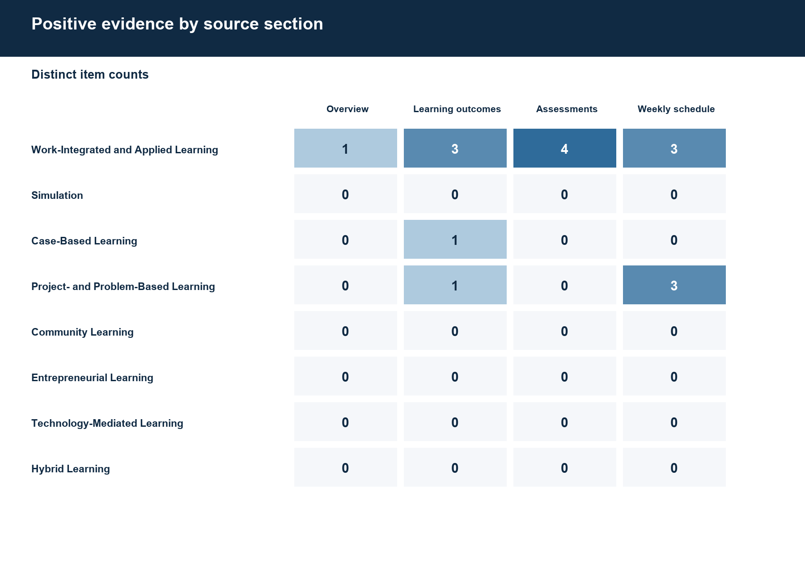

# CS-44 INFS Pedagogical Innovation Taxonomy

This repository contains the transparent extraction-to-visualisation proof of
concept developed for the CS-44 project. It supports both the original INFS6600
pilot and the expanded 2026 INFS corpus workflow. Both use the same current
eight-category scoring configuration and retain the source evidence, matched
rules, scores, and official URLs required for review.

## MySQL database integration

The [database module](database/README.md) preserves course offerings, source evidence,
versioned rules and scoring results in MySQL. It includes a 22-table schema,
four analysis views, a restorable SQL dataset and an offline replay of the saved
2026 capture. See its README for environment setup, restoration, rebuilding and
UG/PG queries. The original corpus workflow below remains available.

## Current corpus workflow

The expanded workflow covers the 12 undergraduate and 15 postgraduate INFS unit
codes in scope. It collects public 2026 unit outlines, records unavailable units
instead of silently substituting another year, and produces discipline-wide and
UG/PG summaries.

Run the full corpus workflow with an existing snapshot:

```bash
python src/run_pipeline.py \
  --mode corpus \
  --snapshot pilot-output/data/raw/cs44_2026_infs_corpus.json
```

Omit `--snapshot` to collect the current public outlines again. Corpus outputs
are written to `pilot-output/` by default.

## Week 4 v2

The Week 4 v2 update expanded the original pilot without rewriting repository
history. Earlier versions remain available in the commit history.

The v2 release:

- expands the configuration to all eight supplied taxonomy categories;
- separates **Simulation** from **Case-Based Learning**;
- treats categories as non-mutually-exclusive multi-label outcomes;
- calibrates the four WIL weights;
- reports positive evidence, review signals, classified score, and review score separately;
- downgrades an administrative `Case studies` assessment label to a review-only signal;
- adds automated regression tests for the expected INFS6600 allocation;
- creates versioned CSV/JSON, Markdown, PNG, and PDF deliverables.

### Eight-person team delivery

The eight-member CS-44 project team completed the Week 4 v2 release, including
taxonomy configuration, INFS6600 evidence analysis, scoring, visualisation,
quality assurance, report production, and final acceptance.

The eight members are Houming Chen, Haidi Sun, Yulei He, Ruochen Tang,
Xiaopeng Ding, Huaicong Yu, Jinfei Qiu, and Yihang Zhao. See
[`docs/week4_team_contributions.md`](docs/week4_team_contributions.md) for the
workstream summary and the meeting-ready Word handout in
[`output/docx/CS-44_Week4_Eight-Person_Work_Allocation.docx`](output/docx/CS-44_Week4_Eight-Person_Work_Allocation.docx).

### Week 4 scope boundary

This release is limited to the agreed changes for the existing INFS6600 pilot.
The remaining taxonomy categories are configured for the complete pilot
taxonomy, but they are not presented as validated classifications. No additional units,
discipline-wide UG/PG analysis, landing page, LLM/RAG component, or formal
model-evaluation study is included in this update.

### Final taxonomy scoring matrix

The meeting-ready workbook
[`output/xlsx/06_Full_Taxonomy_Scoring_Matrix_v5_Final.xlsx`](output/xlsx/06_Full_Taxonomy_Scoring_Matrix_v5_Final.xlsx)
contains the current reviewed scoring baseline. It integrates the latest four
weight changes and two keyword additions while retaining the distinction between
active and proposed rules. Earlier workbook versions remain preserved.

## Current INFS6600 result

The v2 pipeline positively allocates INFS6600 to three categories:

1. **Work-Integrated and Applied Learning**
2. **Case-Based Learning**
3. **Project- and Problem-Based Learning**

| Category | Positive items | Review items | Classified score | Review score | Result |
|---|---:|---:|---:|---:|---|
| Work-Integrated and Applied Learning | 11 | 1 | 49.0 | 2.0 | Positive |
| Simulation | 0 | 0 | 0.0 | 0.0 | No match |
| Case-Based Learning | 1 | 2 | 4.0 | 5.0 | Positive + review items |
| Project- and Problem-Based Learning | 4 | 2 | 14.5 | 4.0 | Positive + review items |
| Community Learning | 0 | 0 | 0.0 | 0.0 | No match |
| Entrepreneurial Learning | 0 | 2 | 0.0 | 6.0 | Review only |
| Technology-Mediated Learning | 0 | 0 | 0.0 | 0.0 | No match |
| Hybrid Learning | 0 | 0 | 0.0 | 0.0 | No match |

Counts are distinct outline items, not raw keyword occurrences. Categories are not mutually exclusive, so counts and future category percentages are not expected to sum to 100%.

## Reviewed v2 visualisations







The original v1 visualisations remain in `visualisations/` and are not deleted.

## Taxonomy v2

The source-of-truth configuration is [`config/taxonomy_v2.json`](config/taxonomy_v2.json). It contains:

- category definitions;
- phrase-rule alternatives and weights;
- category overlap notes;
- review guidance;
- multi-label and deduplication policy;
- provisional positive and high-confidence thresholds.

The eight categories are:

1. Work-Integrated and Applied Learning
2. Simulation
3. Case-Based Learning
4. Project- and Problem-Based Learning
5. Community Learning
6. Entrepreneurial Learning
7. Technology-Mediated Learning
8. Hybrid Learning

## WIL scoring weights

| Rule group | v1 | v2 | Status |
|---|---:|---:|---|
| Authentic practice | 3.5 | 4.0 | Team calibrated |
| Theory-practice integration | 2.5 | 2.0 | Team calibrated |
| Practical teamwork | 2.0 | 2.5 | Current reviewed baseline |
| Career readiness | 1.5 | 2.0 | Provisional team calibration |

The positive threshold (`3.0`) and high-confidence threshold (`5.0`) remain configurable and explicitly marked as provisional pending validation.

## Requirements

- Python 3.10 or later
- Internet access when fetching the public outline
- Packages listed in `requirements.txt`

```bash
python -m pip install -r requirements.txt
```

## Run the INFS6600 pilot pipeline

From the repository root:

```bash
python src/run_pipeline.py --mode pilot
```

The default public source is:

<https://www.sydney.edu.au/units/INFS6600/2026-S2C-NE-CC>

For a reproducible offline run using an existing extracted snapshot:

```bash
python src/run_pipeline.py \
  --mode pilot \
  --snapshot output/v2/data/raw/infs6600_outline.json
```

To use a different compatible taxonomy:

```bash
python src/run_pipeline.py \
  --mode pilot \
  --taxonomy path/to/taxonomy.json \
  --output-dir output/custom \
  --pdf-output-dir output/custom-pdf
```

## Generated and committed v2 deliverables

```text
output/
├── docx/
│   └── CS-44_Week4_Eight-Person_Work_Allocation.docx
├── pdf/
│   ├── 02_Classification_Algorithm_Detailed_v2.pdf
│   └── 05_INFS6600_Course_Category_Mapping_v2.pdf
├── pptx/
│   └── CS-44_Week4_INFS6600_Taxonomy_Pilot_v2.pptx
├── xlsx/
│   ├── 06_Full_Taxonomy_Scoring_Matrix_v2.xlsx
│   ├── 06_Full_Taxonomy_Scoring_Matrix_v3.xlsx
│   ├── 06_Full_Taxonomy_Scoring_Matrix_v4.xlsx
│   └── 06_Full_Taxonomy_Scoring_Matrix_v5_Final.xlsx
└── v2/
    ├── data/
    │   ├── raw/infs6600_outline.json
    │   └── processed/
    │       ├── classification_results.json
    │       ├── classified_evidence.csv
    │       ├── review_queue.csv
    │       └── unit_category_summary.csv
    ├── reports/
    │   ├── infs6600_course_information.md
    │   ├── pilot_results_v2.md
    │   ├── course_category_mapping_v2.md
    │   └── course_category_mapping_v2.csv
    ├── visualisations/
    │   ├── category_summary.png
    │   ├── category_scores.png
    │   └── evidence_by_section.png
    └── release_manifest_v2.json
```

The release manifest records SHA-256 hashes for the generated deliverables.

## Tests

Run the offline unit and regression tests:

```bash
python -m unittest discover -s tests -v
```

The regression suite verifies:

- exactly eight configured categories;
- separate Simulation and Case-Based categories;
- calibrated WIL weights;
- one weight contribution per rule even when several alternatives match;
- true multi-label item classification;
- review-only handling of administrative case labels;
- separate positive and review score aggregation;
- the expected three-category INFS6600 result without Simulation inheritance.

## Source files

| File | Purpose |
|---|---|
| `config/taxonomy_v2.json` | Versioned eight-category definitions, rules, policies, and weights |
| `src/fetch_outline.py` | Downloads and structures the public outline |
| `src/fetch_corpus.py` | Collects the full 2026 INFS corpus |
| `src/taxonomy_config.py` | Loads and validates the taxonomy configuration |
| `src/classify.py` | Scores multi-label evidence and writes positive/review/summary outputs |
| `src/classify_corpus.py` | Applies the same eight-category rules across the full corpus |
| `src/generate_unit_summary.py` | Produces a readable course-information summary |
| `src/generate_course_mapping.py` | Produces the complete eight-category mapping |
| `src/generate_report.py` | Produces the evidence-led Markdown report |
| `src/visualize.py` | Generates the three v2 PNG figures |
| `src/generate_pdf_reports.py` | Generates the two PDF deliverables |
| `src/generate_week4_work_allocation.py` | Generates the eight-person Week 4 meeting handout |
| `src/run_pipeline.py` | Runs and hashes the complete workflow |
| `tests/` | Offline unit and Week 4 regression tests |

## Limitations and open configuration points

- The current phrase rules favour transparency over semantic coverage.
- The parser depends on the current public outline structure.
- The thresholds have not been empirically validated against a reviewed labelled set.
- The Career readiness weight of 2.0 remains provisional.
- Discipline-wide results remain preliminary and require manual validation against source outlines.

See [`docs/configuration_points.md`](docs/configuration_points.md) for the unresolved questions and [`docs/week4_delivery_checklist.md`](docs/week4_delivery_checklist.md) for the delivery status.

## Intended use

This repository is an educational research prototype using public unit-outline information. It supports transparent manual review and does not make automated high-stakes decisions about teaching quality.
