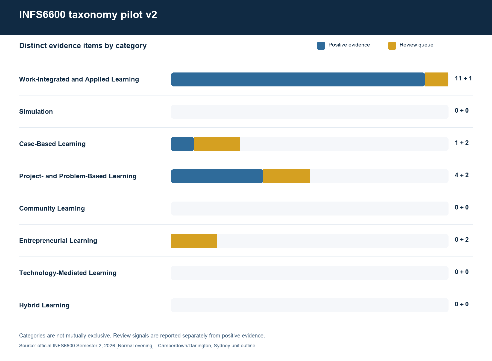
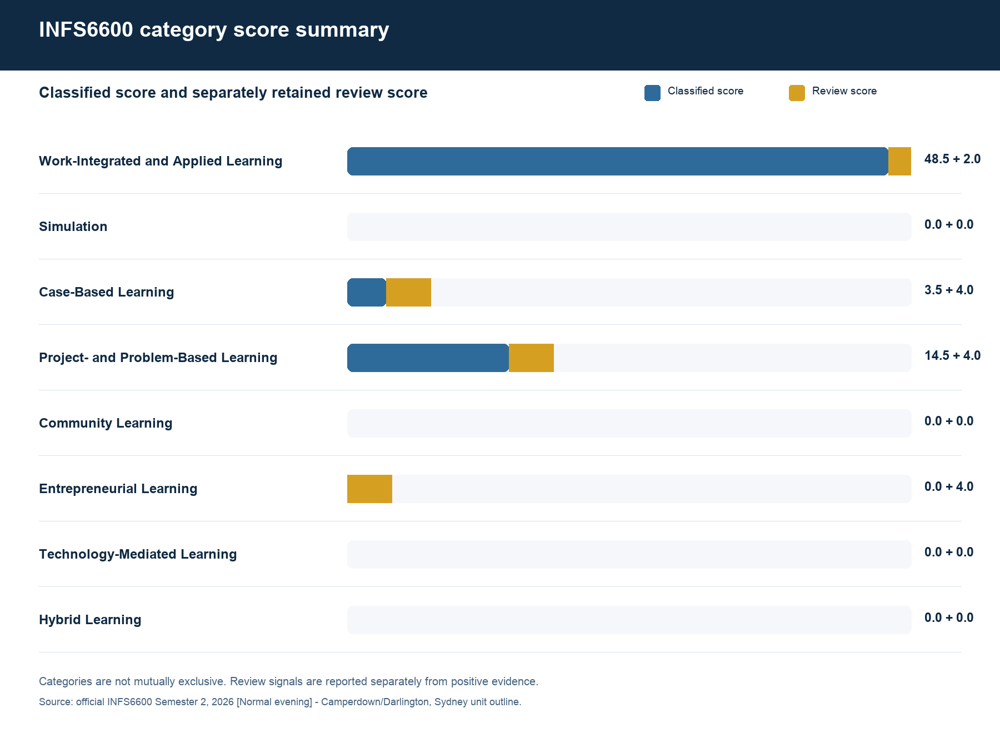
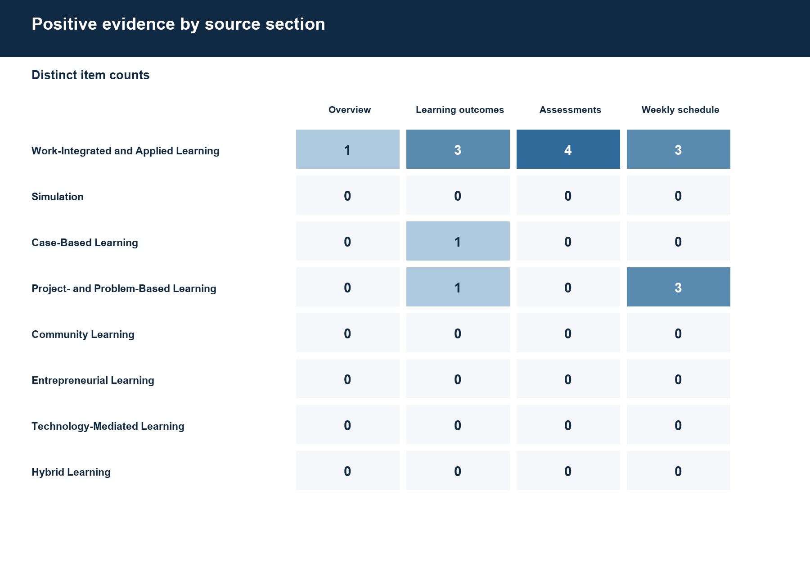

# INFS6600 taxonomy pilot v2

**Unit:** INFS6600 - Business Information Systems Capstone

**Outline:** Semester 2, 2026 [Normal evening] - Camperdown/Darlington, Sydney

**Taxonomy:** 2026-09-01-week4-v2

**Official source:** https://www.sydney.edu.au/units/INFS6600/2026-S2C-NE-CC

## Team delivery statement

The eight-member CS-44 project team completed the Week 4 v2 release, including taxonomy configuration, INFS6600 evidence review, quality assurance, report production, and final acceptance.

## Executive result

INFS6600 is positively classified into: **Work-Integrated and Applied Learning**, **Case-Based Learning**, **Project- and Problem-Based Learning**.

This is a multi-label result. Categories are not mutually exclusive, and one evidence item may support more than one category.

| Category | Status | Positive items | Review items | Classified score | Review score |
|---|---|---:|---:|---:|---:|
| Work-Integrated and Applied Learning | positive | 11 | 1 | 48.5 | 2.0 |
| Simulation | no_match | 0 | 0 | 0 | 0 |
| Case-Based Learning | positive | 1 | 2 | 3.5 | 4.0 |
| Project- and Problem-Based Learning | positive | 4 | 2 | 14.5 | 4.0 |
| Community Learning | no_match | 0 | 0 | 0 | 0 |
| Entrepreneurial Learning | review_only | 0 | 2 | 0 | 4.0 |
| Technology-Mediated Learning | no_match | 0 | 0 | 0 | 0 |
| Hybrid Learning | no_match | 0 | 0 | 0 | 0 |

## Week 4 changes implemented

- Simulation and Case-Based Learning are separate categories.
- INFS6600 may appear in several categories; the classifier does not force a single winner.
- Authentic practice is weighted 4.0; theory-practice integration 2.0; practical teamwork 2.0; career readiness 2.0, with the last weight retained as provisional.
- Administrative `Case studies` assessment labels are weak review signals with weight 2.0, rather than automatic positive evidence.
- Total classified score, review score, distinct evidence count, and source-section distribution are reported separately.

## Positive evidence

| Category | Section | Item | Score | Confidence | Matched rules |
|---|---|---|---:|---|---|
| Work-Integrated and Applied Learning | overview | OV01 Overview paragraph 1 | 10.0 | high | authentic practice; theory-practice integration; practical teamwork; career readiness |
| Work-Integrated and Applied Learning | learning_outcome | LO01 Learning outcome 1 | 4.0 | moderate | actual organisation or professional context |
| Case-Based Learning | learning_outcome | LO02 Learning outcome 2 | 3.5 | moderate | explicit scenario method |
| Work-Integrated and Applied Learning | learning_outcome | LO03 Learning outcome 3 | 4.0 | moderate | actual organisation or professional context |
| Project- and Problem-Based Learning | learning_outcome | LO03 Learning outcome 3 | 4.0 | moderate | authentic problem or challenge |
| Work-Integrated and Applied Learning | learning_outcome | LO04 Learning outcome 4 | 4.0 | moderate | actual organisation or professional context |
| Work-Integrated and Applied Learning | assessment | AS06 Business Models Submission of partner's business, operating models, and IS architecture | 4.0 | moderate | industry or business partner |
| Work-Integrated and Applied Learning | assessment | AS08 Pitch to Partner Slides submission before class Delivered during class time | 4.0 | moderate | industry or business partner |
| Work-Integrated and Applied Learning | assessment | AS10 Boardroom Presentation Slides submission before class Live presentation | 3.5 | moderate | professional presentation |
| Work-Integrated and Applied Learning | assessment | AS11 Boardroom Presentation Q&A Q&A post boardroom presentation | 3.5 | moderate | professional presentation |
| Project- and Problem-Based Learning | weekly_schedule | WK01 Week 01: Unit Introduction & Project Immersion | 3.5 | moderate | project immersion |
| Work-Integrated and Applied Learning | weekly_schedule | WK02 Week 02: Partner Briefing & Group Collaboration | 4.0 | moderate | industry or business partner |
| Project- and Problem-Based Learning | weekly_schedule | WK03 Week 03: Problem & Opportunity Scoping | 3.5 | moderate | problem and opportunity scoping |
| Work-Integrated and Applied Learning | weekly_schedule | WK05 Week 05: Pitch to Partner | 4.0 | moderate | industry or business partner |
| Project- and Problem-Based Learning | weekly_schedule | WK09 Week 09: Prototype Validation | 3.5 | moderate | design and prototype method |
| Work-Integrated and Applied Learning | weekly_schedule | WK12 Week 12: Boardroom Presentation | 3.5 | moderate | professional presentation |

## Manual-review queue

| Category | Section | Item | Score | Reason |
|---|---|---|---:|---|
| Case-Based Learning | assessment | AS06 Business Models Submission of partner's business, operating models, and IS architecture | 2.0 | Review-only rule: administrative case-studies label |
| Case-Based Learning | assessment | AS12 Group Report Written report | 2.0 | Review-only rule: administrative case-studies label |
| Work-Integrated and Applied Learning | weekly_schedule | WK01 Week 01: Unit Introduction & Project Immersion | 2.0 | Below positive threshold: project immersion |
| Project- and Problem-Based Learning | weekly_schedule | WK04 Week 04: Project Planning | 2.0 | Review-only rule: generic project planning |
| Entrepreneurial Learning | weekly_schedule | WK07 Week 07: Ideation | 2.0 | Review-only rule: generic ideation or prototyping |
| Entrepreneurial Learning | weekly_schedule | WK08 Week 08: Prototyping | 2.0 | Review-only rule: generic ideation or prototyping |
| Project- and Problem-Based Learning | weekly_schedule | WK10 Week 10: Implementation Planning | 2.0 | Review-only rule: generic project planning |

## Scoring and aggregation

1. Split the public outline into distinct overview, learning-outcome, assessment, and weekly-schedule items.
2. Normalise case, whitespace, apostrophes, and dash variants while preserving the original evidence text.
3. Evaluate each item once against every category. Alternative phrases inside one rule contribute that rule's weight only once.
4. A positive item must reach the provisional positive threshold and must contain at least one non-review-only rule.
5. Deduplicate at item-category level. The same item may count once in several categories because the taxonomy is multi-label.
6. Sum positive item scores to obtain the classified unit-category total. Report review scores separately rather than mixing ambiguous labels into the positive total.

The current thresholds are positive >= 3.0 and high confidence >= 5.0. Their status is `provisional_pending_validation`; they remain configurable and are not presented as empirically validated cut-offs.

## Category standards

### Work-Integrated and Applied Learning

An educational approach that explicitly merges theory with real-world practice and embeds authentic industry, workplace, or community-relevant work and tasks into a unit of study.

Overlap: May overlap with Project- and Problem-Based Learning, Case-Based Learning, Community Learning, and Entrepreneurial Learning.

Review guidance: Check that professional or partner language describes an authentic learning task rather than a generic context statement.

### Simulation

An instructional method that recreates or mimics real-world scenarios, environments, or processes so learners can practise skills and make decisions safely.

Overlap: Separated from Case-Based Learning in the Week 4 taxonomy. A real-world scenario alone is not a simulation unless the activity recreates, mimics, or role-plays a setting or process.

Review guidance: Do not inherit Simulation from a case-study label or from Case-Based Learning evidence.

### Case-Based Learning

An active teaching method in which students use real-world scenarios and case studies to build critical-thinking and problem-solving skills.

Overlap: May overlap with Work-Integrated and Applied Learning and Project- and Problem-Based Learning. Industry context does not exclude a case-based classification.

Review guidance: An administrative assessment type such as 'Case studies' is retained as a weak review signal and is not sufficient by itself for a positive classification.

### Project- and Problem-Based Learning

Learning focused on real-world problems and challenges using problem-solving, decision-making, investigative, and self-directed learning skills.

Overlap: May overlap with Work-Integrated and Applied Learning when projects involve clients or industry partners, and with Case-Based Learning when cases are used inside a project.

Review guidance: Do not classify from the generic word 'project' alone; require a problem, challenge, immersion, investigation, or explicit project/problem-based method.

### Community Learning

Learning undertaken together with or for communities, including service-learning, field studies, and professional communities of practice.

Overlap: May overlap with Work-Integrated and Applied Learning when the authentic partner is a community organisation.

Review guidance: Require an explicit community, service-learning, field-study, or community-of-practice activity.

### Entrepreneurial Learning

Learning that develops the knowledge, skills, and mindset to recognise opportunities, turn ideas into action, and manage new ventures under uncertainty.

Overlap: May overlap with Project- and Problem-Based Learning and Simulation when learners develop or simulate a venture.

Review guidance: Generic ideation, pitching, or prototyping is a review signal unless explicitly connected to entrepreneurship, a startup, a product-development project, or a venture.

### Technology-Mediated Learning

An instructional environment in which digital devices, networks, or specialised technologies mediate access to content and interaction during learning.

Overlap: May overlap with Simulation, Hybrid Learning, or Entrepreneurial Learning. Merely studying digital technology is not evidence that learning is technology-mediated.

Review guidance: Require the technology to be part of the learning method, not only the subject matter.

### Hybrid Learning

An education model that mixes face-to-face classroom teaching with online digital instruction.

Overlap: May overlap with Technology-Mediated Learning, but requires an explicit combination of physical and online modes.

Review guidance: Online materials alone are insufficient; require an explicit hybrid, blended, flipped, hyflex, or mixed-mode design.

## Limitations and decisions still required

- The 3.0 and 5.0 thresholds are provisional and require validation or sensitivity testing against reviewed labels.
- Career readiness is set to 2.0 and remains marked provisional in the configuration.
- Phrase matching does not understand negation, complex context, or semantic equivalence.
- This Week 4 iteration reruns INFS6600 only; no additional-unit or discipline-wide analysis is included.
- Landing-page, LLM/RAG, and formal model-evaluation work are outside this update.

## Visualisations

