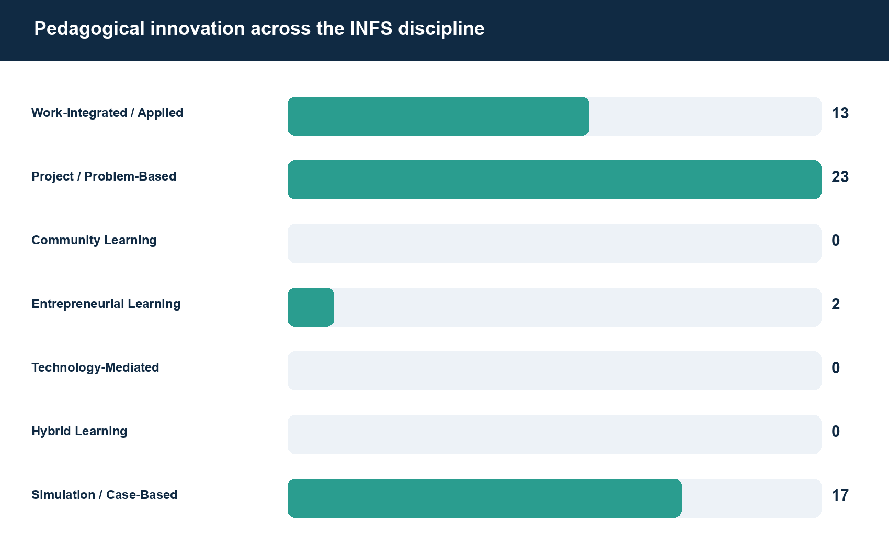
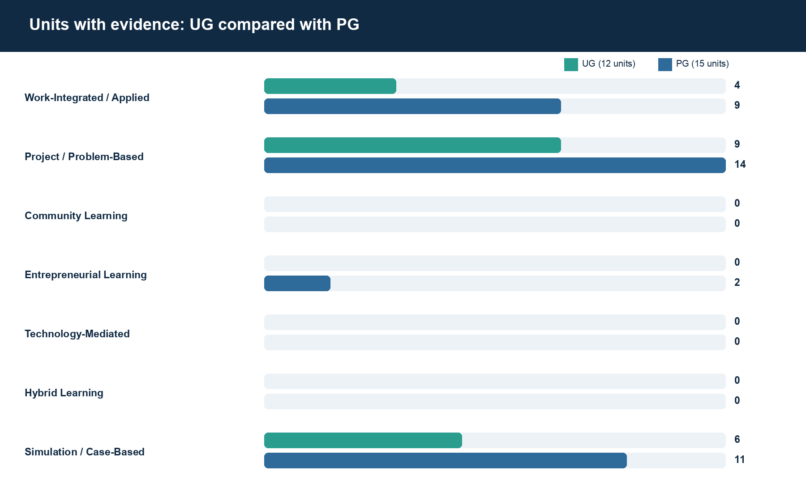

# CS-44 2026 INFS corpus results

Fetched **26 of 27** requested public unit outlines.

## Discipline and level comparison

| Category | All units | UG units | PG units | Evidence items |
|---|---:|---:|---:|---:|
| Work-Integrated and Applied Learning | 13 | 4 | 9 | 35 |
| Project- and Problem-Based Learning | 23 | 9 | 14 | 79 |
| Community Learning | 0 | 0 | 0 | 0 |
| Entrepreneurial Learning | 2 | 0 | 2 | 4 |
| Technology-Mediated Learning | 0 | 0 | 0 | 0 |
| Hybrid Learning | 0 | 0 | 0 | 0 |
| Simulation and Case-Based Learning | 17 | 6 | 11 | 50 |

A unit is counted once per category when at least one distinct outline item reaches that category's rule threshold. Evidence-item totals are reported separately.

## Collection failures

| Unit | Level | Error |
|---|---|---|
| INFS3080 | UG | No public 2026 outline found for INFS3080 |

## Visualisations

