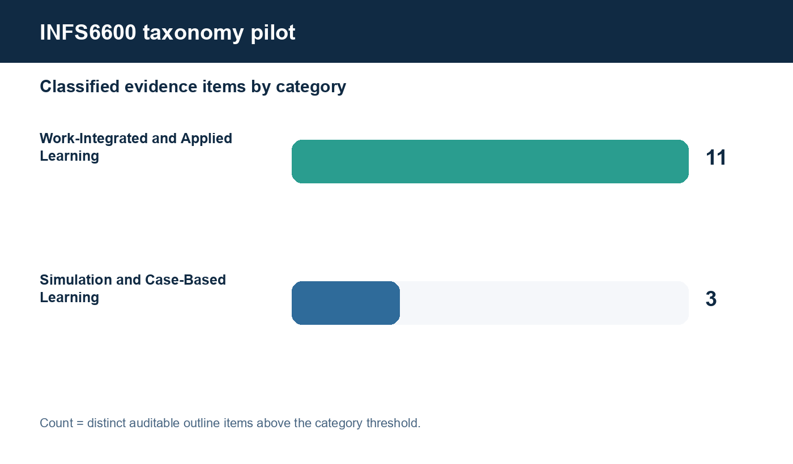
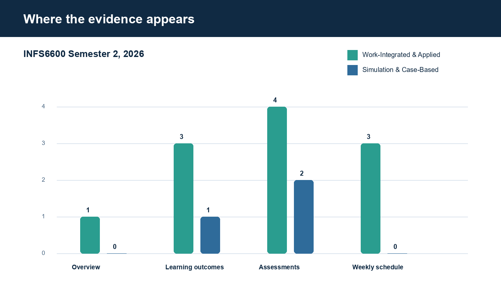

# INFS6600 two-category taxonomy pilot

**Unit:** INFS6600 - Business Information Systems Capstone
**Outline:** Semester 2, 2026 [Normal evening] - Camperdown/Darlington, Sydney
**Official source:** https://www.sydney.edu.au/units/INFS6600/2026-S2C-NE-CC

## Result

| Category | Evidence items | Interpretation |
|---|---:|---|
| Work-Integrated and Applied Learning | 11 | Strong, repeated evidence across the outline. |
| Simulation and Case-Based Learning | 3 | Limited, explicit evidence; manual confirmation recommended. |

The counts are not raw keyword frequencies. One count means one distinct overview paragraph, learning outcome, assessment row or weekly-schedule row classified above the threshold.

## Evidence

| Category | Section | Outline item | Score | Confidence | Matched rule |
|---|---|---|---:|---|---|
| Work-Integrated and Applied Learning | overview | Overview paragraph 1 | 9.5 | high | authentic practice; theory-practice integration; practical teamwork; career readiness |
| Work-Integrated and Applied Learning | learning_outcome | Learning outcome 1 | 4.0 | moderate | actual organisation or professional context |
| Simulation and Case-Based Learning | learning_outcome | Learning outcome 2 | 3.5 | moderate | explicit scenario method |
| Work-Integrated and Applied Learning | learning_outcome | Learning outcome 3 | 4.0 | moderate | actual organisation or professional context |
| Work-Integrated and Applied Learning | learning_outcome | Learning outcome 4 | 4.0 | moderate | actual organisation or professional context |
| Work-Integrated and Applied Learning | assessment | Business Models Submission of partner's business, operating models, and IS architecture | 4.0 | moderate | industry or business partner |
| Simulation and Case-Based Learning | assessment | Business Models Submission of partner's business, operating models, and IS architecture | 4.0 | moderate | explicit case method |
| Work-Integrated and Applied Learning | assessment | Pitch to Partner Slides submission before class Delivered during class time | 4.0 | moderate | industry or business partner |
| Work-Integrated and Applied Learning | assessment | Boardroom Presentation Slides submission before class Live presentation | 3.5 | moderate | professional presentation |
| Work-Integrated and Applied Learning | assessment | Boardroom Presentation Q&A Q&A post boardroom presentation | 3.5 | moderate | professional presentation |
| Simulation and Case-Based Learning | assessment | Group Report Written report | 4.0 | moderate | explicit case method |
| Work-Integrated and Applied Learning | weekly_schedule | Week 02: Partner Briefing & Group Collaboration | 4.0 | moderate | industry or business partner |
| Work-Integrated and Applied Learning | weekly_schedule | Week 05: Pitch to Partner | 4.0 | moderate | industry or business partner |
| Work-Integrated and Applied Learning | weekly_schedule | Week 12: Boardroom Presentation | 3.5 | moderate | professional presentation |

## Algorithm

1. Fetch the latest Semester 2 official outline and split it into auditable items: overview paragraphs, learning outcomes, assessment rows and weekly-schedule rows.
2. Normalise case, whitespace and dash variants without removing the original evidence text.
3. Apply category-specific phrase rules derived from the supplied definitions and examples. Strong explicit phrases score 3.5-4.0; supporting phrases score 1.5-2.5.
4. Classify an item only when its category score reaches 3.0. This prevents isolated generic terms such as 'project', 'business' or 'presentation' from creating a positive result.
5. Deduplicate at item-category level and retain the matched rules, score, source section and official URL for audit.
6. Place sub-threshold matches in a review queue rather than counting them.

## Category standards used

### Work-Integrated and Applied Learning

An educational approach that explicitly merges theory with real-world practice and embeds authentic industry, workplace or community-relevant work and tasks into a unit of study.

Threshold: 3.0. Explicit evidence is required; contextual similarity alone is not counted in this two-day pilot.

### Simulation and Case-Based Learning

Learning through real-world scenarios, cases or simulations that allow students to apply knowledge and skills in contexts resembling professional practice.

Threshold: 3.0. Explicit evidence is required; contextual similarity alone is not counted in this two-day pilot.

## Limitations and next step

This is a transparent baseline, not a final semantic classifier. The administrative assessment type 'Case studies' is counted as explicit case-based evidence, but should be confirmed with the client because the task description itself concerns a partner's business model. The next iteration should add client-reviewed labels and compare precision/recall against a small manually annotated set before adding embeddings or an LLM.

## Visualisations

